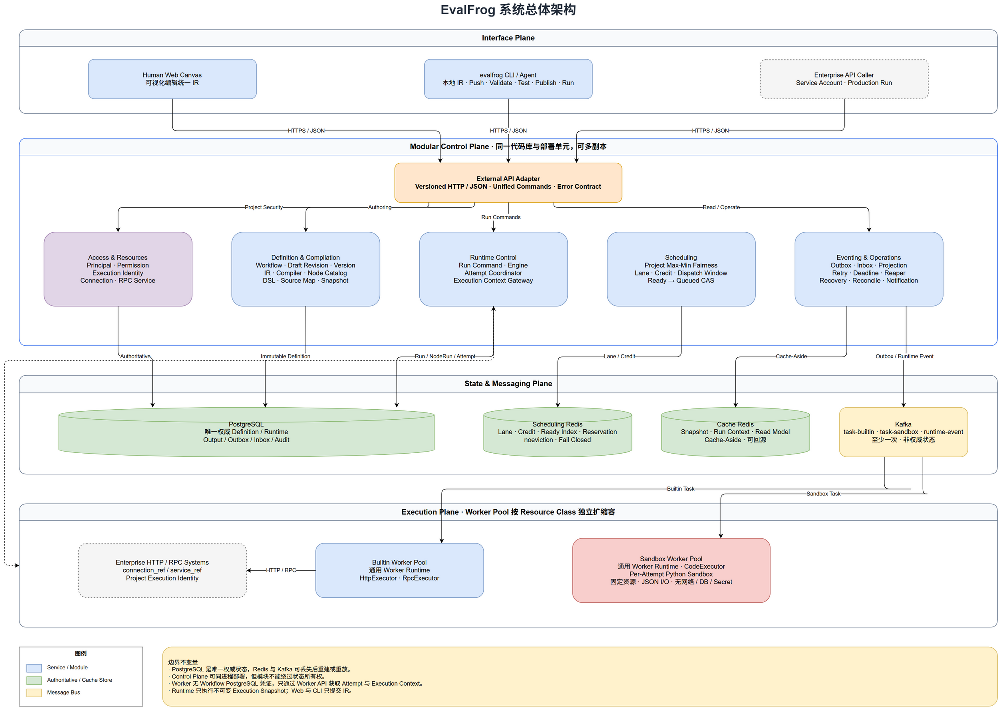

# EvalFrog

> CLI-first Enterprise Workflow Runtime

EvalFrog 是一个同时面向 Human Web 与 Agent CLI 的企业级 Workflow Platform。它的目标不是在第一阶段提供大量节点和外围功能，而是先建立一个边界清晰、可恢复、可追踪、可以长期演进的 Workflow 核心。

当前状态：**M5 Runtime PostgreSQL、Outbox/Inbox 与事件驱动推进已实现，下一阶段为 M6 Project 公平 Scheduler 与 Scheduling Redis**。第一阶段开发路线与验收门槛见 [项目实施计划](./docs/plans/项目实施计划与验收标准.md)。

## 为什么是 EvalFrog

传统 Workflow 系统通常只服务前端画布，Agent 只能绕过平台生成私有格式；另一类系统则只面向代码和 API，Human 难以理解和维护定义。

EvalFrog 让两类作者使用同一种 IR：

```text
Human Web Canvas ─┐
                  ├→ Canonical JSON IR → Server Compiler → Immutable DSL
evalfrog CLI ─────┘
```

- Human 可以通过 Web Canvas 编辑、测试、发布和运行 Workflow；
- Agent 可以在本地生成具有语义 ID 的 IR，通过 `evalfrog` CLI 上传、校验、测试和发布；
- Runtime 只执行平台 Compiler 生成的不可变 Execution Snapshot；
- Runtime Error 通过 Source Map 定位回 IR Node、Edge 和具体字段。

## 系统架构



可编辑源文件：[EvalFrog_系统架构.drawio](./docs/architecture/EvalFrog_系统架构.drawio)

第一阶段采用：

```text
Human Web + evalfrog CLI + Enterprise API
                 ↓
Modular Control Plane（同一代码库与部署单元，可多副本）
                 ↓
PostgreSQL + Scheduling Redis + Cache Redis + Kafka
                 ↓
Builtin Worker Pool + Sandbox Worker Pool
```

Control Plane 是模块化单体，不是一个没有边界的大 Service。Definition、Compiler、Runtime Engine、Scheduler、Attempt Coordinator、Execution Context、Eventing 和 Recovery 拥有独立职责，可以同进程部署，但不能互相绕过状态所有权。

## M0 Quick Start

前置条件：Go `1.26+`、Docker 与 Docker Compose。

Windows 使用一条命令构建并启动 PostgreSQL、Scheduling Redis、Cache Redis、Kafka、Migration、Control Plane 和两个 Worker，随后运行 CLI Doctor：

```powershell
powershell -NoProfile -ExecutionPolicy Bypass -File .\scripts\dev.ps1
```

Linux/macOS：

```bash
./scripts/dev.sh
```

启动成功后：

| 入口 | 地址 |
|---|---|
| Control Plane | `http://localhost:8080` |
| Builtin Worker Health | `http://localhost:8081/health/ready` |
| Sandbox Worker Health | `http://localhost:8082/health/ready` |
| PostgreSQL | `localhost:15432` |
| Scheduling Redis | `localhost:16379` |
| Cache Redis | `localhost:16380` |
| Kafka | `localhost:29092` |

停止进程但保留本地数据：

```powershell
powershell -NoProfile -ExecutionPolicy Bypass -File .\scripts\down.ps1
```

M0 CLI 命令：

```text
evalfrog version
evalfrog config validate --profile local --config-dir configs
evalfrog doctor --profile local --config-dir configs
```

上述命令来自 M0 的进程与基础设施闭环。当前 Control Plane 已提供 M3 Definition API，但还没有创建真实 Workflow Run 的 Runtime API；开发环境中的 Project、Principal 与 Managed Resource 仍需通过数据库测试 Fixture 或后续管理面初始化。

## M1 Authoring Contract

M1 已提供 Human Web 与 Agent CLI 共用的作者态契约：

- [IR v1 JSON Schema](./contracts/ir/v1/schema.json)；
- `internal/ir` 中的 Go Model、有界 Draft Parser、Strict Validator、Canonical JSON、SHA-256 Hash 和结构化 Diagnostic；
- `internal/catalog` 中的 `catalog-v1` 及 Start、End、Branch、Code、HTTP、RPC 六类无版本号公共 Node Description；
- [版本化正反例与 Golden Fixture](./contracts/ir/v1/fixtures/manifest.json)。

Draft Parser 允许保存具有合法 IR 外壳但尚未完整的画布；Test/Publish 必须使用显式绑定 Catalog 的 Strict Validator。M1 当时尚未实现 Draft API、Compiler 或 Workflow 运行。

## M2 Runtime Contract 与确定性 Compiler

M2 已实现不依赖数据库、Redis、Kafka 或 HTTP Adapter 的确定性编译链：

- [DSL v1 JSON Schema](./contracts/dsl/v1/schema.json) 与独立 Runtime Model；
- [Source Map v1 JSON Schema](./contracts/source-map/v1/schema.json)、Node/Edge Key-Value 映射、字段精确解析和 Node 回退；
- `internal/compiler` 中的 Handler Registry、Control Graph Validator、Resource Bindings、Project Policy、Manifest 与四类 Hash；
- 单 Start/End DAG、全图可达、Branch Route、隐式 OR-Join 和 `Active(Target) ⇒ Active(Source)` 静态校验；
- `control.start/end/branch@1` 与 `task.python/http/rpc@1` Operation 编译；
- Runtime DSL 自校验和执行前全量 Operation Compatibility Check。

编译器输入中的 Resource Bindings 在 M3 已由 Resources 模块完成作者与 Project Execution Identity 双重授权后解析。M2 本身仍保持纯函数边界，不访问数据库、Redis 或 Kafka；M4 Runtime Engine 只消费该层生成的不可变 DSL/Snapshot。

## M3 Definition 生命周期

M3 已将作者态定义生命周期接入真实 PostgreSQL：

- User、Service Account、Project Permission 与 Project Execution Identity 权限模型；
- Connection、RPC Service、Secret Reference 元数据及双重授权；
- Workflow、Draft Pointer、不可变 Draft Revision、Published Version 与 Execution Snapshot；
- SaveDraft 乐观并发控制，Validate/Test/Publish 共用同一版本化 Compiler Pipeline；
- Publish 幂等、自动激活、事务内 Snapshot/Version/Active Pointer/Audit 原子提交；
- 历史版本回滚只移动 Active Pointer，Copy 读取保存的 IR Snapshot，不反编译 DSL；
- [External API v1 OpenAPI](./contracts/openapi/v1.yaml) 与 [M3 PostgreSQL Migration](./migrations/000001_m3_definition_lifecycle.up.sql)。

M3 的 Test 接口只生成可复用的不可变 Test Snapshot，不创建 Workflow Run；真正的 Test Run 与 Production Run 将从 M4-M5 的 Runtime 状态机和持久化接通。

## M4 Runtime Domain 与 Engine

M4 已在不依赖 PostgreSQL、Redis、Kafka 或真实 Worker 的条件下证明运行语义：

- Workflow Run、Node Run、Node Attempt 的封闭状态模型、State Version 与全部合法/非法迁移；
- CreateRun 对 Test/Production Definition Source 和 Snapshot ID/Definition Hash 的不可变绑定；
- Start/End/Branch Control Node 无 Attempt，Task Node 通过 Effective Attempt 暴露唯一有效 Output；
- 排他 Branch、全部六类 JSON Operator、并行路径、隐式 OR-Join 和唯一 `skipped` 语义；
- 业务 Retry 与基础设施 Recovery 独立计数，重复、乱序、迟到 Result 和 RetryDue 幂等收敛；
- Fail-Fast、首个 Termination Intent 胜出、Cancel/Deadline 和 End/Output/Run Success 原子语义；
- 结构化 Runtime Failure 保存 Run、Snapshot、Definition、Execution Node、Attempt 与 DSL Field 坐标；
- Deterministic In-Memory Harness 跑通 20 个代表性 Workflow 和 100 个随机合法 DAG Property Case。

M4 没有创建 Runtime 数据库表、External Run API、Outbox/Inbox、Scheduler、Kafka Task 或 Worker 执行。M5 将把同一领域操作映射到 PostgreSQL Transaction/CAS 和可恢复事件循环。

## M5 Runtime PostgreSQL 与事件驱动推进

M5 已将 M4 Aggregate 映射到真实 PostgreSQL 权威状态与可恢复事件循环：

- [Runtime Migration](./migrations/000002_m5_runtime_eventing.up.sql) 提供 Run、Node Run、Attempt、Output Candidate、Outbox、Inbox、Idempotency 与确定访问路径索引；
- TestDraft 明确绑定 `draft_revision + snapshot_id`，Production CreateRun 在事务内解析 Active Published Version；两者只创建 Pending Run 与 RunCreated Outbox；
- Engine Consumer 通过 Inbox、Run 行锁、受校验 Aggregate Restore 与 State Version CAS 原子初始化整张图或推进状态；
- Attempt Coordinator 的 Claim、Heartbeat、Complete 与 Lost 使用 Lease/Fencing；Attempt 终态、Output Candidate、Completion Outbox 同事务；
- Outbox Relay 使用 `FOR UPDATE SKIP LOCKED` 与有期限 Claim，可在发布前或发布后崩溃后恢复；重复发布由 Inbox 收敛；
- `node_output_values` 保存候选值，只有 `node_runs.effective_attempt_id` 被 Engine 接受后才对下游有效。

M5 只定义版本化 Runtime Event DTO 与 Publisher Port，尚未连接真实 Kafka Broker；也未实现 `ready → queued + Attempt + NodeTask Outbox`，该原子派发边界属于 M6。External Run HTTP API、Worker Transport 和 Execution Context Cache-Aside 仍分别属于后续里程碑。

## 开发检查

```bash
go test ./...
go test -race ./...
go test -count=20 ./contracts/ir ./contracts/dsl ./contracts/source-map ./contracts/openapi ./internal/ir ./internal/catalog ./internal/dsl ./internal/sourcemap ./internal/compiler ./internal/access ./internal/resources ./internal/adapters/httpapi ./internal/runtime ./internal/runtime/engine ./internal/runtime/attempt ./internal/eventing
go test ./internal/ir -run='^$' -fuzz=FuzzParser -fuzztime=5s
go test ./internal/ir -run='^$' -fuzz=FuzzLogicalID -fuzztime=5s
go vet ./...
go build ./cmd/...
go test -tags=integration ./tests/integration
```

架构测试会扫描仓库依赖，并拒绝 Domain 导入 Adapter、Compiler 导入 HTTP/PostgreSQL/Redis/Kafka Client、Worker 导入 PostgreSQL Adapter、Runtime 读取作者态模型、Scheduler 导入 Engine，以及新增 `common/utils/service/pkg` 等逃逸边界的目录。

## 核心架构原则

### 不可变执行定义

- Draft 可以保存不完整 IR，也可以测试；
- 每次保存成功形成不可变 Draft Revision；
- Publish 永远创建并自动激活新的不可变 Published Version；
- Production Run 必须先发布，没有 Published Version 时不能正式调用；
- Test Run 和 Production Run 都只执行不可变 Execution Snapshot；
- Run 创建后不跟随 Draft 或 Active Version 变化。

### IR 与 DSL 分离

| 模型 | 使用者 | 目的 |
|---|---|---|
| IR | Human、Agent、Web、CLI | 编辑、理解、Diff、Copy、错误定位 |
| DSL | Compiler、Runtime | 强约束、版本化、不可变执行语义 |
| Source Map | Control Plane | DSL Runtime Error → IR Node/Edge/Field |

CLI 可以上传 IR，并下载平台生成的 DSL、Source Map 和诊断；不能上传客户端 DSL 或覆盖 Source Map。

### 状态所有权

| 组件 | 负责 |
|---|---|
| Engine | Run/NodeRun 语义推进、Branch、Retry、Skipped、终态 |
| Scheduler | Project 公平准入、创建并派发 Attempt |
| Attempt Coordinator | Claim、Heartbeat、Complete、Lease、Fencing、Output Candidate |
| Execution Context Gateway | 向 Worker 只读装配 Snapshot、Input、Effective Output |
| Worker | 执行一个 Attempt，不修改 Workflow 状态 |

### 数据职责

- PostgreSQL：Definition、Runtime、Output、Outbox/Inbox、权限与审计的唯一权威状态；
- Scheduling Redis：Lane、Credit、Ready Index、Inflight Reservation，可从 PostgreSQL 重建；
- Cache Redis：Execution Snapshot、Run Context、Effective Output、Run Read Model，Cache Miss 时回源；
- Kafka：Builtin Task、Sandbox Task、Runtime Event 的至少一次传输，不承担权威状态。

## 第一阶段节点

### Control Node

- `start`
- `end`
- `branch`

Control Node 由 Compiler 和 Engine 解释，不创建 Worker Attempt，也不进入 Kafka Task Topic。

### Task Node

- `http`：只允许 `connection_ref + relative_path`；
- `rpc`：只允许 `service_ref + operation`；
- `code`：只支持 Python，在 Per-Attempt Sandbox 中执行。

Code Sandbox 使用固定资源规格和 JSON Object 输入输出，不提供 Network、Database 或 Secret 权限。

## 调度与执行

EvalFrog 不使用全局 FIFO。项目公平性的唯一身份是 `project_id`：

- 竞争 Project 之间采用等权 Max-Min Fairness；
- 空闲 Project 的额度可以被其他 Project 借用；
- Project 内按 `priority DESC, ready_at ASC, node_run_id ASC` 稳定选择；
- Kafka 前使用有界 Dispatch Window，禁止深度预派发；
- Scheduling Redis 使用固定 Lane 和批量 Credit，数据库 CAS 是最终裁决。

Worker 只有在本地执行槽可用时才领取 Task：

```text
Consume Task
→ ClaimAttempt
→ queued → running + Lease/Fencing
→ ACK Kafka
→ LoadExecutionContext
→ Execute
→ CompleteAttempt
→ Completion Event
→ Engine 接受 Effective Output
```

## 计划中的 CLI 命令面

以下是已经冻结的目标命令面；在对应里程碑完成前不代表当前仓库已经实现：

```text
evalfrog workflow create|list|get|copy
evalfrog workflow draft pull|push|validate|test
evalfrog workflow publish
evalfrog workflow run start|status|list|cancel
evalfrog node-type list|describe
evalfrog connection list|describe
```

Agent 生成的 Workflow 文件是普通 Canonical JSON IR，不需要理解内部 Catalog Revision、DSL Operation Version、Kafka Topic 或 Worker 拓扑。

## 目标代码结构

```text
evalfrog/
├─ cmd/
│  ├─ evalfrog/
│  ├─ control-plane/
│  ├─ worker-builtin/
│  └─ worker-sandbox/
├─ web/
├─ contracts/
│  ├─ ir/
│  ├─ dsl/
│  ├─ source-map/
│  ├─ openapi/
│  └─ messages/
├─ internal/
│  ├─ access/
│  ├─ resources/
│  ├─ definition/
│  ├─ ir/
│  ├─ catalog/
│  ├─ compiler/
│  ├─ dsl/
│  ├─ sourcemap/
│  ├─ runtime/{engine,attempt,context}/
│  ├─ scheduling/
│  ├─ eventing/
│  ├─ recovery/
│  ├─ projection/
│  ├─ worker/{runtime,executor}/
│  └─ adapters/
├─ migrations/
├─ configs/
├─ deployments/
└─ docs/
```

代码依赖只能朝向领域核心：

```text
Interface / Transport Adapter
            ↓
Application Module
            ↓
Domain Model + Port
            ↑
Infrastructure Adapter
```

## 技术栈

- Go：Control Plane、CLI、Worker Runtime 与 Builtin Executor；
- PostgreSQL：权威 Definition/Runtime 数据、Outbox/Inbox；
- Redis：Scheduling Store 与 Cache Store；
- Kafka：TaskBus 与 Runtime Event；
- Python Sandbox：Code Node 隔离执行；
- HTTP/JSON：External API 与第一阶段 Worker API；
- Web Canvas：前端技术选型在 Web 实施阶段确定，不影响 IR/API 契约。

## 可靠性模型

- 所有消息按至少一次处理；
- Outbox、Inbox、CAS、Idempotency Key 和 Fencing 共同保证业务幂等；
- ACK Kafka 不等待节点执行完成，Worker 故障由数据库 Lease 恢复；
- `attempt_seq`、`retry_count`、`recovery_count` 分别记录物理执行、业务重试和基础设施恢复；
- 只有 `effective_attempt_id` 对应的 Output 能被下游读取；
- Redis 丢失不丢 Workflow，Kafka 乱序不改变状态机正确性；
- Engine 不永久拥有 Run，任一实例都能通过数据库状态和 Inbox/CAS 接管。

## 文档

- [项目准则](./项目准则.md)
- [面试复习学习文档](./docs/learning/学习文档.md)
- [核心架构决策](./docs/architecture/decisions/00_核心架构决策基线.md)
- [分布式调度与 Worker 边界](./docs/architecture/decisions/01_分布式调度与Worker执行边界.md)
- [节点模型与执行能力](./docs/architecture/decisions/02_节点模型与执行能力边界.md)
- [IR 编辑态结构](./docs/architecture/decisions/03_IR编辑态结构基线.md)
- [Control Graph 语义](./docs/architecture/decisions/04_ControlGraph语义基线.md)
- [项目实施计划与验收标准](./docs/plans/项目实施计划与验收标准.md)

## 第一阶段不做什么

- DSL Upload 或 DSL→IR Decompiler；
- Artifact Store；
- SQL、LLM、Agent、Human Approval、Plugin Node；
- Loop、Join、Optional Reference、Data Merge；
- Redis Streams、Kafka Delay Topic、Definition Event Topic；
- 提前拆成大量微服务。

这些能力可以后续增加，但不能以破坏 IR/DSL、版本、状态、调度和 Worker 边界为代价。

## 开发状态

M0 已提供四个可构建入口、三套严格配置 Profile、Local Compose、健康检查、Migration Runner、基础可观测性与依赖护栏。M1 已冻结作者态 IR 与 Node Catalog Contract；M2 已实现确定性 Compiler、DSL、Source Map 和 Control Graph 静态校验；M3 已实现 Access、Managed Resources、Definition PostgreSQL 持久化与首批 Draft/Publish API；M4 已实现纯领域 Runtime 状态机和确定性 Engine。Runtime PostgreSQL、External Run API、Outbox/Inbox、Scheduler、Kafka Task Dispatch 与 Worker 节点执行仍是后续阶段，README 不把计划能力描述成当前成果。
